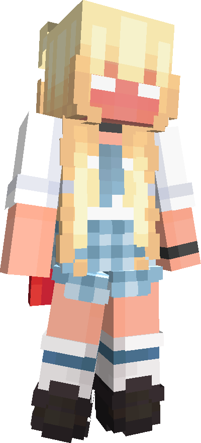
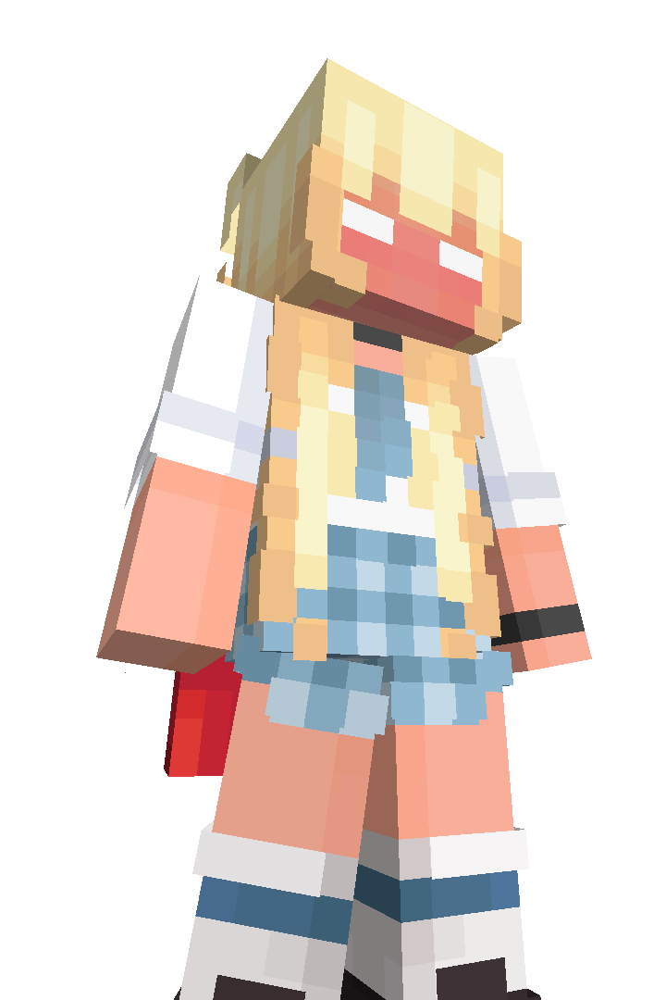

# Starlight SkinAPI Wrapper
<p align="center">
    
</p>

This package is a Starlight SkinAPI wrapper

Oficial Starlight SkinAPI Documentation : https://docs.lunareclipse.studio/

### Installation
```bash
npm install starlightskinapi
```

fetchSkinInfo function usage:
```ts
import { fetchSkinInfo } from "../src";

async function main(){
    const playerNickname = "RinckoZ_";
    const skinInfo = await fetchSkinInfo(playerNickname)

    if (skinInfo){
        console.log(skinInfo.playerUUID)
        console.log(skinInfo.skinUrl)
        console.log(skinInfo.userCape)
        console.log(skinInfo.skinTextureWidth)
        console.log(skinInfo.skinTextureHeight)
    }
}
main();
```
Output:
```bash
f169e30f110943dfba445da3b7dee1ce
http://textures.minecraft.net/texture/4d24cc4874ba673963ca57818a0be02666aa80f4747d00b45571e380ed9b54f7
http://textures.minecraft.net/texture/2340c0e03dd24a11b15a8b33c2a7e9e32abb2051b2481d0ba7defd635ca7a933
64
64
```

Getting a render pose of your skin
> _If you do not specify the properties in the options object, the RenderType by default is "Default" and the RenderCrop by default is "Full"_
```ts
import { fetchSkinRender } from "../src";

async function main(){
    const playerNickname = "RinckoZ_";
    const skinUrl = await fetchSkinRender(playerNickname)

    if (skinUrl){
        console.log(skinUrl)
    }
}
main();
```
Output:
```bash
https://starlightskins.lunareclipse.studio/skin-render/default/RinckoZ_/full
```

You can set the type that the function will return. The available types are: "string" and "buffer"

```ts
import { RenderCrops, RenderTypes, fetchSkinRender } from "../src";
import { writeFile } from "node:fs/promises"

async function main(){
    const playerNickname = "RinckoZ_";
    const renderResult = await fetchSkinRender(playerNickname, {
        type: RenderTypes.Default,
        crop: RenderCrops.Full,
        export: "buffer",
    })

    if (renderResult){
        await writeFile("./render.png", renderResult);
    }
}
main();
```
Output:



You can customize the model, camera and lighting options

```ts
import { RenderCrops, RenderTypes, fetchSkinRender } from "../src";
import { writeFile } from "node:fs/promises"

async function main(){
    const playerNickname = "RinckoZ_";

    const renderResult = await fetchSkinRender(playerNickname, {
        type: RenderTypes.Default,
        crop: RenderCrops.Full,
        export: "buffer",
        model: {
            capeEnabled: true,
            // ... other model options ...
        },
        camera: {
            cameraPosition: { x: "10", y: "10", z: "-20" },
            cameraWidth: 720,
            cameraHeight: 1080,
            // ... other camera options ...
        },
        lighting: {
            dirLightPos: { x: "-10", y: "10", z: "-10" },
            // ... other lighting options ...
        },
    });

    if (renderResult){
        await writeFile("./customized.png", renderResult);
    }
}
main();
```

Output:

